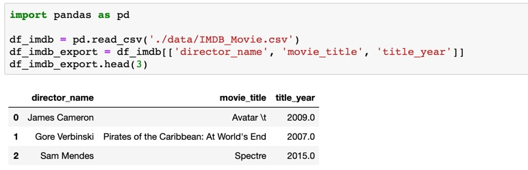
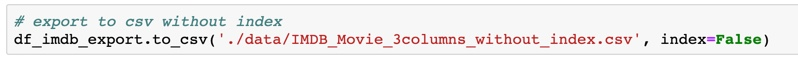
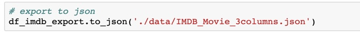
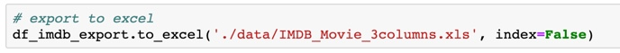
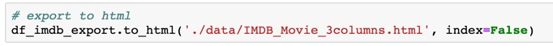

Pandas support ability to export from data frame to many difference type of data.

Let prepare some data before we try to export.

#### To csv

`csv` is very common file type to export out. Pansas use function `to_csv` to export  from data frame to csv file

#### To json

`to_json` is used to export frame to json

#### To excel

#### To html

